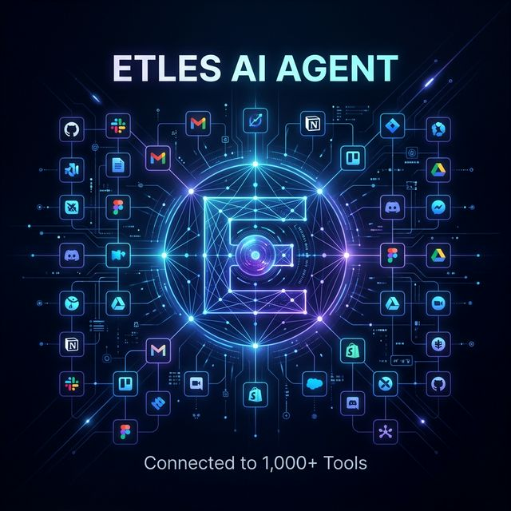

<a href="https://etles.vercel.app">
  
  <h1 align="center">Etles</h1>
</a>

<p align="center">
    Etles is a powerful, open-source autonomous agent platform built with Next.js and the AI SDK that delegates complex administrative, sales, and operational tasks to a suite of specialized AI sub-agents.
</p>

<p align="center">
  <a href="https://chatbot.dev"><strong>Read Docs</strong></a> ·
  <a href="#features"><strong>Features</strong></a> ·
  <a href="#model-providers"><strong>Model Providers</strong></a> ·
  <a href="#deploy-your-own"><strong>Deploy Your Own</strong></a> ·
  <a href="#running-locally"><strong>Running locally</strong></a>
</p>
<br/>

## Features

- **Autonomous Sub-Agents Framework**
  - Includes 26+ specialized agents out of the box (e.g., SDR, Chief of Staff, Project Manager, Incident Responder, Cloud Cost Optimizer).
  - Sub-agents operate intelligently out-of-band to perform complex, multi-step actions and proactive delegations.
- **Deep Triggers & Automations (via Composio)**
  - Seamlessly connect to over 100+ platforms (Jira, Slack, Salesforce, Stripe, GitHub).
  - Configure active background triggers in real-time, enabling reactive agent workflows.
- **Advanced Agent Toolkit**
  - **Memory:** Agents save, recall, and update long-term user memories via Upstash Vector.
  - **Scheduling:** Fully conversational cron jobs and reminders powered by Upstash QStash.
  - **File Storage:** Store and retrieve files with Vercel Blob.
  - **Generative UI:** Interactive components natively stream charts, documents, and real-time weather into the chat.
- [Next.js](https://nextjs.org) App Router
  - Edge routing functionality mapping to highly resilient Server Components (RSCs) and Server Actions.
- [AI SDK](https://ai-sdk.dev/docs/introduction)
  - Unified API for generating text, structured objects, and tool calls with LLMs
  - Hooks for building dynamic chat and generative user interfaces
  - Supports OpenAI, Anthropic, Google, xAI, and other model providers via AI Gateway
- [shadcn/ui](https://ui.shadcn.com)
  - Styling with [Tailwind CSS](https://tailwindcss.com)
  - Component primitives from [Radix UI](https://radix-ui.com) for accessibility and flexibility
- Data Persistence
  - [Neon Serverless Postgres](https://vercel.com/marketplace/neon) for saving chat history and user data
  - [Vercel Blob](https://vercel.com/storage/blob) for efficient file storage
- [Auth.js](https://authjs.dev)
  - Simple and secure authentication

## Model Providers

This template uses the [Vercel AI Gateway](https://vercel.com/docs/ai-gateway) to access multiple AI models through a unified interface. The default model is [OpenAI](https://openai.com) GPT-4.1 Mini, with support for Anthropic, Google, and xAI models.

### AI Gateway Authentication

**For Vercel deployments**: Authentication is handled automatically via OIDC tokens.

**For non-Vercel deployments**: You need to provide an AI Gateway API key by setting the `AI_GATEWAY_API_KEY` environment variable in your `.env.local` file.

With the [AI SDK](https://ai-sdk.dev/docs/introduction), you can also switch to direct LLM providers like [OpenAI](https://openai.com), [Anthropic](https://anthropic.com), [Cohere](https://cohere.com/), and [many more](https://ai-sdk.dev/providers/ai-sdk-providers) with just a few lines of code.

## Deploy Your Own

You can deploy your own version of Chatbot to Vercel with one click:

[](https://vercel.com/templates/next.js/chatbot)

## Running locally

You will need to use the environment variables [defined in `.env.example`](.env.example) to run Chatbot. It's recommended you use [Vercel Environment Variables](https://vercel.com/docs/projects/environment-variables) for this, but a `.env` file is all that is necessary.

> Note: You should not commit your `.env` file or it will expose secrets that will allow others to control access to your various AI and authentication providep accounts.

1. Install Vercel CLI: `npm i -g vercel`
2. Link locah instance with Vercel and GitHub accounts (creates `.vercel` directory): `vercel link`
3. Download your environment variables: `vercel env pull`

```bash
pnpm install
pnpm db:migrate # Setup database or apply latest database changes
pnpm dev
```

Your app template should now be running on [localhost:3000](http://localhost:3000).
